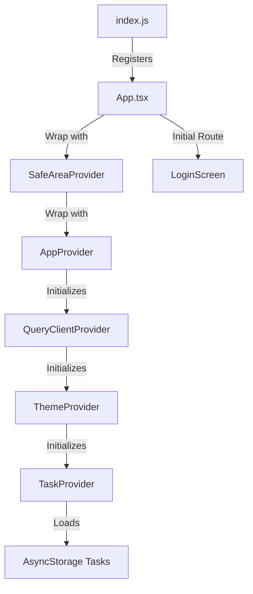

# 🧭 Project Architecture & Data Flow Guide (How it works)

Yeh guide batati hai ke is project (`tasskflowRN`) ka architecture kaisa hai, files aapas mein kaise connect hain, aur data kaise flow karta hai.

---

## 🗂️ Project Directory Structure

Sabse pehle files ka structure samajhein:

```
tasskflowRN/
├── App.tsx                   # Main entry point & Routing setup
├── index.js                  # App registry loader
├── package.json              # Library dependencies & scripts
├── src/
│   ├── AppProvider.tsx       # Global providers wrapper (Theme, Query, Tasks)
│   ├── api/
│   │   └── client.ts         # Axios client with base URL & Interceptors
│   ├── components/
│   │   └── Card.tsx          # Reusable Card Component
│   ├── context/
│   │   ├── TaskContext.tsx   # Global tasks state and AsyncStorage sync
│   │   └── ThemeContext.tsx  # Light/Dark mode state management
│   ├── hooks/
│   │   ├── useAi.ts          # AI Coach requests & local fallbacks
│   │   ├── useFlaskApi.ts    # Flask server health check
│   │   └── useTasks.ts       # Re-exporting TaskContext hook
│   ├── layouts/
│   │   └── SafeAreaLayout.tsx# Notch & spacing protection wrapper
│   ├── screens/
│   │   ├── LoginScreen.tsx   # App Entry Screen (simple authentication)
│   │   ├── HomeScreen.tsx    # Tasks list, filter tabs, stats & new task input
│   │   ├── TaskDetailsScreen.tsx # Details of task, Priority selector & AI edit suggestions
│   │   └── AICoachScreen.tsx # Student mood coaching interface
│   └── types/
│       └── index.ts          # Central TypeScript interfaces & types
```

---

## 🔄 App Bootup Flow (App Kaise Start Hoti Hai?)



1. **`index.js`** sabse pehle run hota hai aur `App.tsx` ko register karta hai.
2. **`App.tsx`** poori app ki tree setup karta hai:
   - `<SafeAreaProvider>`: Mobile ke top notch aur bottom home indicator ke space ko control karta hai.
   - `<AppProvider>`: Sabhi providers (React Query, Theme, Task Context) ko wrap karta hai.
   - `<NavigationContainer>` aur `<Stack.Navigator>`: Screens ki list generate karte hain aur batate hain ke initial screen **`LoginScreen`** hogi.

---

## 📡 Data Flow & State Management

App mein data handle karne ke 3 tareeqe use ho rahe hain:

### 1. Global App State (`TaskContext.tsx`)
Tasks ka saara data (add, delete, update, status toggle) global state mein handle hota hai.
* **Flow:**
  1. App start hote hi `TaskProvider` ke andar ka `useEffect` run hota hai.
  2. `loadTasks()` pehle **AsyncStorage** (phone ki hard disk/local storage) check karta hai.
  3. Agar storage mein purana data na mile (pehli launch par), to yeh backend mock API (`jsonplaceholder.typicode.com`) se 5 dummy tasks fetch karke **AsyncStorage** mein save kar deta hai aur state (`tasks`) update karta hai.
  4. App ki doosri screens (`HomeScreen`, `TaskDetailsScreen`) is data ko consume karti hain custom hook **`useTasks()`** ke zariye.
  5. Jab bhi koi task change hota hai (jaise complete toggle), state update hoti hai aur wahi update local storage mein sync ho jati hai.

### 2. Network Client API (`api/client.ts`)
Flask Server se communication ke liye **Axios** use kiya gaya hai.
* **Android Emulator Port Binding:** Android emulator virtual network par chalta hai, isliye computer ke local port `5000` (Flask) ko access karne ke liye address `10.0.2.2:5000` bind kiya gaya hai. iOS direct `localhost:5000` use karta hai.
* **Interceptors:** Requests ko filter/debug karne ke liye interceptors lagaye gaye hain.

### 3. Server State / AI Prompts (`hooks/useAi.ts`)
TanStack Query (`useMutation`) ke zariye server state manage hoti hai:
* **AI Description Generation (`useAiDescription`):**
  - Jab user click karta hai "AI Suggestion", to task ka *title* server ko `/api/ai-description` par post hota hai.
  - Server description generate karke wapas deta hai.
  - **Fallback:** Agar Flask server run na ho raha ho, to code crash nahi karta. Local conditions check karke pre-defined static smart suggestion wapas de di jati hai (e.g. biology related title ho to biology ki suggestion).
* **AI Motivation Coach (`useAiMotivation`):**
  - AI Coach screen par user apni feeling likh kar send karta hai.
  - Request `/api/ai-motivation` par jati hai jo mood identify kar ke counseling quote deti hai.
  - **Fallback:** Server offline hone par emotion keywords check karke (stressed, tired, happy) offline advice aur mood render ho jata hai.

---

## 🗺️ Screen Navigation Flow

App mein Stack Navigation use ho rahi hai:

1. **LoginScreen:** User input leta hai. Success par `navigation.navigate('Home', { username })` chalta hai aur user ka name carry forward hota hai.
2. **HomeScreen:** 
   - User ko welcome message dikhta hai (username parameter se).
   - Tasks filter tabs hote hain (All, Pending, Completed).
   - Naya task text-box se add kiya ja sakta hai.
   - Task par click karne se `navigation.navigate('TaskDetails', { taskId: task.id })` call hota hai.
   - AI Coach floating icon par click karne se `navigation.navigate('AICoach')` call hota hai.
3. **TaskDetailsScreen:**
   - URL parameters se `taskId` nikalta hai aur specific task detail load karta hai.
   - Priority update (LOW, MEDIUM, HIGH) aur AI description generation perform hoti hai.
4. **AICoachScreen:**
   - Chat-like interface hai jahan mood feeling submit karne par custom advice receive hoti hai.
